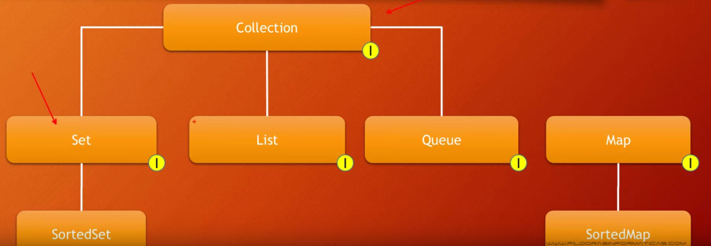

# UT9 Ej11: Preguntas video 179

**Nombre: Jose Cabrera Rojas** 
**Ciclo: 1º DAW**  

## Responder a las preguntas:

### Las Colecciones son almacenes de objetos dinámico (Verdadero /Falso)

Verdadero.

### Una colección es capaz de almacenar tipos de datos primitivos (Verdadero/Falso)

Falso.

### Enumera tres ventajas de las colecciones.

Tienen un tamaño dinámico, pueden ir provistas de ordenamiento, se pueden insertar y eliminar elementos.

### ¿Qué es una Collection? una Interfaz/Clase/Objeto

Una interfaz.

### Captura la jerarquía de interfaces de Collection

### Una Queue no permite el acceso aleatorio (Verdadero/Falso)

verdadero.

### La interfaz Map permite identificar a los elementos sin usar una clave numérica (Verdadero/Falso)

Falso.

  

### Intefaz List. Enumera las ventajas y desventajas.

Como ventajas tenemos: 
- Acceso aleatorio. 
- Están ordenadas. 
- Añadir y eliminar sin restricción. 
- ListIterator modifica la dirección. 
- Sintaxis similar a arrays 

Como desventaja tenemos: 
- Bajo rendimiento en operaciones concretas.

### Intefaz List. Enumera las clases de la API de java que implementan esta interfaz.

ArrayList, LinkedList, Vector, CopyOnWriteArrayList.

### Una de las ventajas de LinkedList es que es muy rápida accediendo a elementos. (Verdadero/Falso)

Falso.

