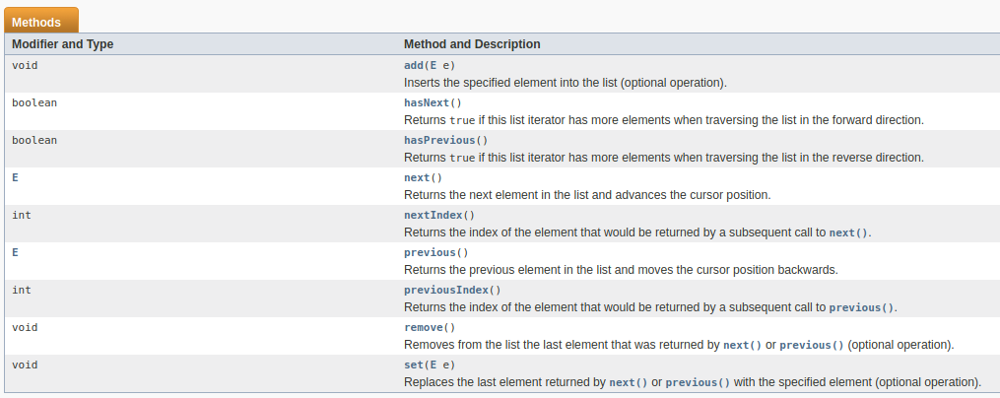

# UT9 Ej12: Preguntas

**Nombre: Jose Cabrera Rojas**<br>
**Ciclo: 1º DAW**<br><br>

<style>
.verde{
    color:#3cc279;
}
.rojo{
    color:#ff2828;
}
</style>

## Responder a las preguntas:

### A la hora de eliminar elementos es mucho más eficiente un ArrayList que un LinkedList. Verdadero/Falso. Indica el motivo.

<p class="verde"><b>Verdadero</b>. Esto se debe a que LinkedList no tiene una buena gestión para el acceso a elementos aleatorios.<p>

### Si tenemos una LinkedList lista de cadenas. Escribe las sentencias válidas.
- **¿Con qué dos métodos agregamos un elemento en la última posición?** 

    ```java
    listaCadenas.add(listaCadenas.size(),"elemento");
    listaCadenas.addLast("elemento");
    listaCadenas.push("elemento");
    ```

- **¿Cómo agregamos un elemento en la tercera posición (tener en cuenta como se numera al primer elemento)?**

    ```java
    listaCadenas.add(2,"elemento");
    ```


- **¿Pon tres formas para obtener el primer elemento de la lista sin eliminarlo?**

    ```java
    listaCadenas.getFirst();
    listaCadenas.get(0);
    listaCadenas.element();
    ```

### Las LinkedList están ordenadas, y por tanto el orden se corresponde con el orden en el que se agregan los elementos en la lista. (Verdadero/Falso)

<p class="verde">Falso.<p>

### Con un Iterador solo puedo moverme hacia delante, pero no hacia atrás (verdadero/falso)

<p class="verde">Verdadero.<p>

<br><br>

### Con un ListIterator, pega aquí una captura de los métodos que encontrarás en la API de java.



### ¿Qué método de ListIterator me permite saber si hay algún elemento más hacia atrás? Y ¿Cuál para obtener el valor del elemento anterior?.

```java
hasPrevious();
previous();
```

### Dado el siguiente ejemplo del video. Modifícalo para que agregue a Miguel después de Sandra, utilizando un ListIterator.

```java
public static void main(String[] args) {
  LinkedList<String> personas = new LinkedList<String>();
  personas.add("Pepe");
  personas.add("Sandra");
  personas.add("Ana");
  personas.add("Laura");
  System.out.println(personas.size());
  
  //Introducir aquí el código

  ListIterator lit = personas.ListIterator(2);

  lit.add("Miguel");
  
  for (String persona : personas) {
    System.out.println(persona);
  }
}
```
